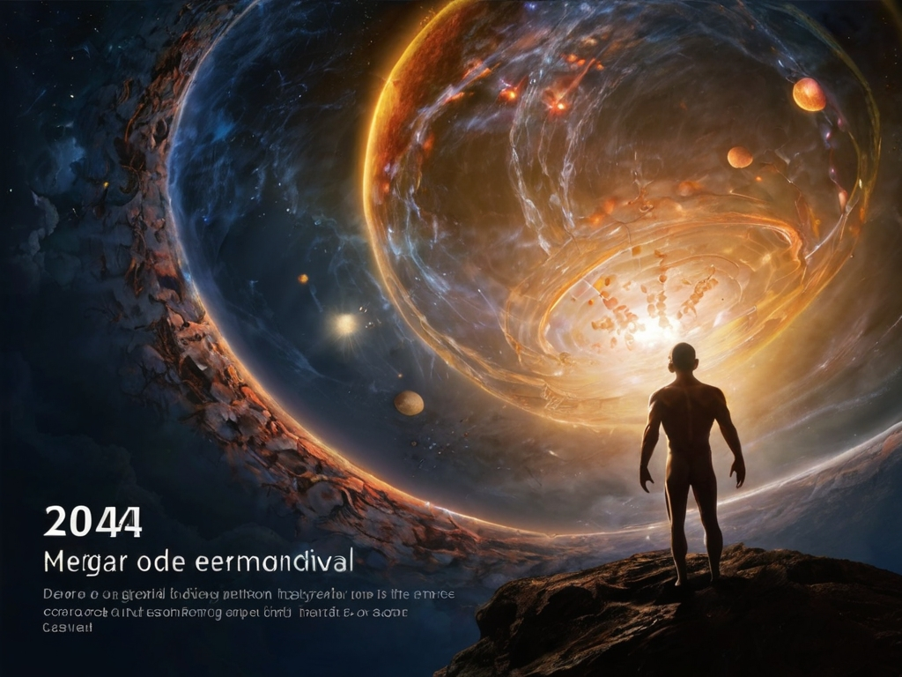

# A Promessa de Vida Eterna em 2045
## Descrição:
**A vida eterna e seus dilemas: O texto faz uma breve reflexão sobre todas as possíveis mudanças que essa nova realidade pode trazer para o que chamamos de sociedade nos dias de hoje, tanto na questão positiva quanto nas possíveis dificuldades e o peso que isso pode gerar no futuro.**

## Tecnologias Utilizadas
**O texto foi editado através da tecnologia de IA generativa: ChatGPT. A imagem foi gerada através da tecnologia de IA generativa: Leonardo.AI.**

# O Futuro em 2045: A Vida Eterna Através da Transferência de Consciência
## Introdução
**Em 2045, a humanidade terá alcançado um marco inimaginável: a possibilidade da vida eterna através da transferência de consciência. Esta inovação tecnológica representa não apenas um salto quântico na ciência, mas também uma revolução em nossa compreensão da existência, identidade e moralidade. Vamos explorar como esta tecnologia moldará a sociedade, a economia, a cultura e a própria natureza da vida humana.**
## A Tecnologia da Transferência de Consciência
**A transferência de consciência envolve a digitalização completa da mente humana, incluindo memórias, emoções e traços de personalidade, para ser transferida para um novo corpo, seja biológico ou sintético. Este avanço é possível graças ao progresso em várias áreas, como neurociência, computação quântica, biotecnologia e inteligência artificial.**
**Em 2045, os avanços na neuroimagem permitiram mapear com precisão cada sinapse do cérebro humano. Supercomputadores quânticos processam esta informação, recriando digitalmente a mente em uma matriz neural artificial. A biotecnologia fornece corpos biológicos projetados, enquanto a robótica e a engenharia avançada produzem corpos sintéticos quase indistinguíveis dos humanos. A IA desempenha um papel crucial na integração da consciência transferida com o novo corpo, garantindo uma transição suave e funcional.**
## Impactos Sociais
**A disponibilidade da vida eterna transformará a estrutura social de maneira profunda. A hierarquia etária tradicional será desafiada, pois indivíduos poderão viver por séculos, ou até milênios, sem os declínios físicos e mentais associados ao envelhecimento. Isto criará novas dinâmicas familiares, com gerações coexistindo por períodos muito mais longos e redefinindo conceitos de herança e sucessão.**
**A imortalidade também influenciará a educação e o trabalho. O aprendizado ao longo da vida se tornará a norma, com indivíduos constantemente atualizando suas habilidades e conhecimentos para se manterem relevantes em um mercado de trabalho em constante evolução. A aposentadoria, como a conhecemos, pode se tornar obsoleta, substituída por períodos regulares de reciclagem e reorientação de carreira.**
**No entanto, a acessibilidade a esta tecnologia será um ponto crítico. Inicialmente, é provável que a transferência de consciência seja um privilégio dos ricos, exacerbando desigualdades sociais. Políticas de inclusão e regulamentações governamentais serão essenciais para democratizar o acesso a esta tecnologia, evitando uma divisão ainda maior entre os afluentes e os desfavorecidos.**
## Implicações Éticas e Filosóficas
**A imortalidade traz consigo um conjunto de dilemas éticos e filosóficos. Questões sobre a identidade pessoal surgem: se nossa consciência pode ser transferida para outro corpo, o que define nossa essência? Somos ainda os mesmos, ou nos tornamos outra entidade com a mudança de corpo?**
**A religião também enfrentará novos desafios. Muitas crenças são baseadas na finitude da vida e no que acontece após a morte. A capacidade de prolongar a vida indefinidamente pode transformar profundamente práticas religiosas, rituais e a própria noção de espiritualidade.**
**O debate sobre os direitos dos seres imortais também será central. Questões como o direito à morte, o consentimento para a transferência de consciência e a integridade pessoal precisarão ser abordadas. Leis e regulamentos precisarão evoluir para proteger esses novos aspectos da existência humana.**
## A Economia da Imortalidade
**A imortalidade terá um impacto econômico substancial. A indústria da saúde se transformará, com menos foco em curar doenças e mais em manutenção e otimização dos corpos hospedeiros. Novos mercados emergirão para corpos sintéticos e biológicos, com empresas especializadas em design e personalização de corpos para diferentes necessidades e preferências.**
**O mercado de trabalho mudará drasticamente. Com a eliminação da aposentadoria e a possibilidade de vidas profissionais prolongadas, as empresas precisarão se adaptar a uma força de trabalho mais experiente e diversificada. Os modelos de negócios se ajustarão para incorporar ciclos de vida mais longos dos produtos e serviços, considerando que seus consumidores podem viver indefinidamente.**
## Cultura e Arte na Era da Imortalidade
**A cultura e a arte também serão profundamente influenciadas. Com vidas estendidas, os indivíduos terão mais tempo para se dedicar à criação e apreciação artística. Obras de arte e movimentos culturais poderão evoluir ao longo de séculos, resultando em uma riqueza de expressão cultural nunca antes vista.**
**A percepção do tempo mudará, alterando nossa relação com o passado e o futuro. Tradições culturais podem se tornar mais profundas, enquanto a inovação artística poderá florescer em novas direções, sem as limitações impostas pela vida finita.**
## Conclusão
**Em 2045, a conquista da vida eterna através da transferência de consciência representará uma transformação sem precedentes na história humana. Esta tecnologia redefinirá a nossa compreensão de vida e morte, identidade e propósito. A sociedade, a economia, a cultura e a ética terão que evoluir para acompanhar esta nova realidade. Com grandes oportunidades vêm grandes desafios, e a humanidade precisará navegar cuidadosamente para garantir que os benefícios da imortalidade sejam acessíveis e éticos para todos. A vida eterna promete uma nova era de possibilidades, onde os limites da existência humana são expandidos além do que jamais imaginamos.**

